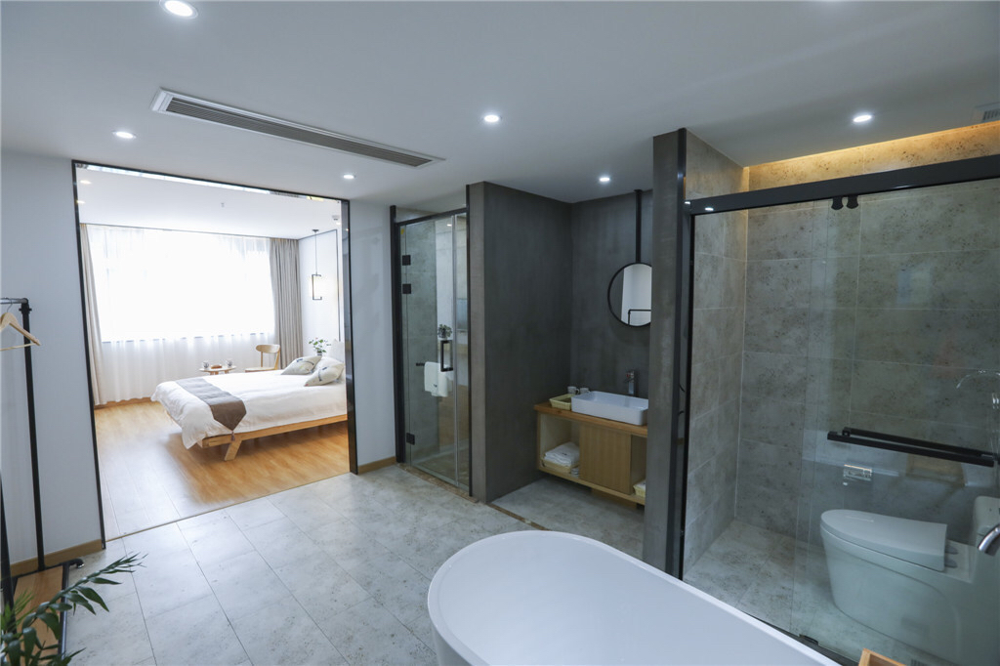
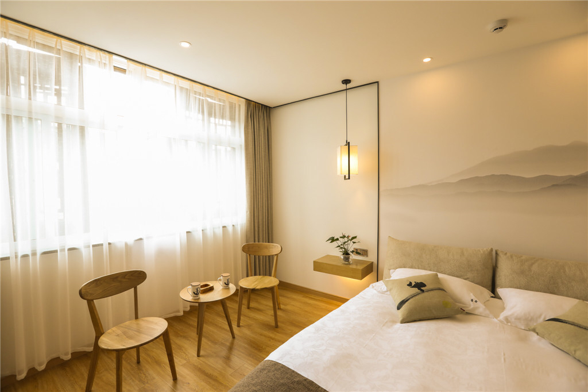
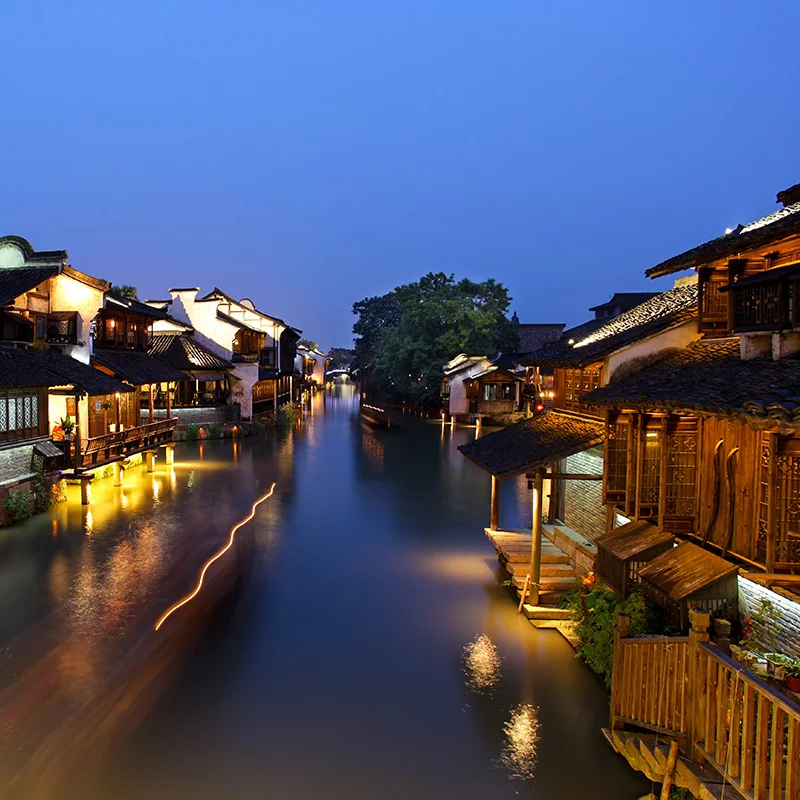
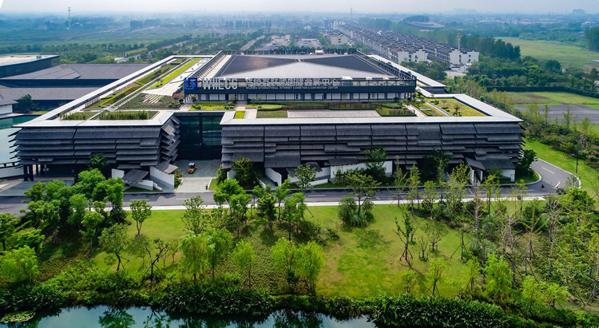

## [清明节](https://baike.baidu.com/item/%E6%B8%85%E6%98%8E%E8%8A%82/137575?fr=aladdin) 旅游计划安排表（4月5日-4月7日）

### [乌镇](http://www.wuzhen.com.cn/)
>国家5A级旅游景区——乌镇,一块古老神奇而又美丽非凡的土地,1300年建镇史的江南水乡古镇,中国首批十大历史文化名镇和中国魅力名镇之一。

### [苏州](https://baike.baidu.com/item/%E8%8B%8F%E5%B7%9E/122945?fr=aladdin)
>苏州，古称吴，简称为苏，又称姑苏、平江等，是国家历史文化名城和风景旅游城市，国家高新技术产业基地，长江三角洲城市群重要的中心城市之一 [1]  、G60科创走廊中心城市、扬子江城市群的重要组成部分，有“人间天堂”的美誉。

### 行程安排

交通: 开车前往乌镇 66公里 1小时到达乌镇 66公里.
	
酒店: 乌镇西栅墨舍精品酒店 

复制这条信息，打开👉飞猪👈即可看到【乌镇西栅墨舍精品酒店 环河路330-332号】￥SM6tbxKAmJh￥ https://mp.dfkhgj.com/trip/router/middlepage.html?land_url=https%3A%2F%2Ftb.cn%2FkE1l0Ew）

	
景点介绍:

1. 西栅景区以人文景观与自然景观的完美结合而见长,适合游览散心又适合拍照. 

2. 西栅夜景(当夜幕降临，平静的河面上映出河畔建筑的灯火光芒，灿烂夺目，美的就像画中的风景一样。与白天江南水镇宁静安逸美相比是另一种美感。西栅中还有适合夜猫子们泡吧的酒吧一条街，是一个休闲放松的好去处。)

	(复制这条信息，打开👉飞猪👈即可看到【我在飞猪发现了一个不错的商品，赶快来看看吧。】￥WoLobxKFTI9￥ https://mp.dfkhgj.com/trip/router/middlepage.html?land_url=https%3A%2F%2Ftb.cn%2Fz7UnxGw)
3. 乌镇互联网国际会展中心

	复制这条信息，打开👉飞猪👈即可看到【乌镇互联网国际会展中心】￥LJqdbxqWu1z￥ https://mp.dfkhgj.com/trip/router/middlepage.html?land_url=https%3A%2F%2Ftb.cn%2FFgdh0Ew

    

